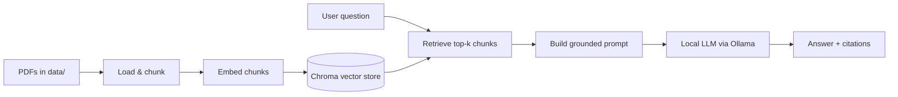

# PaperTrail

Ask questions about your own documents and get answers grounded in the source text — with citations, and an honest "I don't know" when the answer isn't there. Runs entirely on your own machine: no API keys, no costs, nothing leaves your computer.

## Demo


## Features

- **Grounded answers** — responses are generated only from your documents, not the model's general knowledge
- **Source citations** — every answer comes with the exact passages it was drawn from (document + page)
- **Honest refusal** — when the documents don't contain the answer, it says so instead of guessing
- **Fully local & free** — embeddings and generation both run locally via Ollama; no API key, no per-query cost
- **Chat interface** — a Streamlit UI with persistent conversation history

## How it works

PaperTrail is a retrieval-augmented generation (RAG) pipeline:



Documents are split into overlapping chunks, embedded, and stored in a local Chroma vector store. At query time, the most relevant chunks are retrieved by semantic similarity, stuffed into a prompt as context, and passed to a local language model that answers using only that context.

## Tech stack

- **Orchestration:** LangChain
- **Vector store:** Chroma (persisted to disk)
- **Embeddings:** sentence-transformers (`all-MiniLM-L6-v2`), run locally
- **Generation:** Ollama (default `llama3.1:8b`)
- **UI:** Streamlit

## Setup

Requires Python 3.10+ and [Ollama](https://ollama.com).

```bash
# 1. Clone and enter the project
git clone https://github.com/cqaxo/papertrail.git
cd papertrail

# 2. Create and activate a virtual environment
python -m venv venv
source venv/bin/activate        # Windows: venv\Scripts\activate

# 3. Install dependencies
pip install -r requirements.txt

# 4. Pull the language model
ollama pull llama3.1:8b
```

## Usage

```bash
# 1. Add the PDFs you want to query
cp your-document.pdf data/

# 2. Build the vector store from your documents
python ingest.py

# 3. Launch the app
streamlit run app.py
```

Then open the URL Streamlit prints (usually http://localhost:8501) and start asking questions.

**Choosing a model.** The generation model is configurable via the `OLLAMA_MODEL` environment variable, defaulting to `llama3.1:8b`:

```bash
export OLLAMA_MODEL=qwen2.5:14b   # a larger model, if your hardware allows
```

The default needs roughly 6 GB of VRAM. It will run on CPU, just more slowly. Lighter machines can drop to a smaller model such as `llama3.2`.

## Design decisions

- **RAG over fine-tuning.** Retrieval keeps answers current as documents change (no retraining), grounds responses in the user's own files, and keeps control over the source material. Fine-tuning would bake knowledge into the weights and go stale.
- **Chunk size 1000 / overlap 150.** The overlap means a sentence that lands on a chunk boundary isn't lost to retrieval. The size balances retrieval precision (smaller chunks = more targeted hits) against giving the model enough surrounding context to answer well.
- **Top-k = 6.** Started at 4; bumping to 6 measurably improved answers on longer documents. Going much higher risks overflowing the model's context window and pulling in less-relevant, noisier chunks.
- **Local embeddings + local generation.** Everything runs on-device — zero cost, full privacy, no API keys. A small, fast embedding model handles retrieval; Ollama handles generation.
- **Configurable model with a modest default.** Defaulting to `llama3.1:8b` keeps the project runnable on common hardware, while `OLLAMA_MODEL` lets anyone scale up (or down) without editing code.
- **Grounding and refusal.** The prompt instructs the model to answer only from the retrieved context and to reply with a fixed phrase — "I don't know based on the provided documents" — when the answer isn't present. That makes refusals predictable and easy to detect programmatically for evaluation.
- **Single source of truth for embeddings.** The embedding model is defined in one place, so the model used to *build* the store can never drift from the one used to *query* it — a mismatch would silently break retrieval.
- **Cached resource loading.** The embedding model and vector store are memoized so they load once per process instead of on every query, keeping the UI responsive.

## Limitations & roadmap

**Current limitations**
- **Retrieval quality.** Naive page-based chunking ingests journal headers, footers, and reference lists that crowd out substantive content, and the small embedding model (`all-MiniLM-L6-v2`) tends to match on keyword overlap rather than meaning. As a result, the system can miss content that genuinely exists in a document — e.g. failing to surface a paper's conclusion or recommendations when the query and the target passage share few literal words.
- **Hallucination.** Small local models can still invent specifics even with grounding (e.g. an example phrase that isn't in the source). Answer quality scales with model size.
- **No incremental updates.** The vector store is rebuilt from scratch on each `ingest.py` run.

**Planned**
- **Evaluation harness** — measure faithfulness, hallucination rate, and retrieval recall across a test set (RAGAS / DeepEval), so each change below can be validated with a before/after rather than guessed at.
- **Better retrieval** — strip boilerplate (headers, footers, reference lists) before chunking, move to a stronger embedding model, and add reranking to push substantive chunks above noise.
- **Multi-tenant access control** — metadata filtering so a user can only retrieve their own documents.
- **Drop the LangChain abstraction** — replace it with a direct retrieve-and-generate loop for full control over the pipeline.