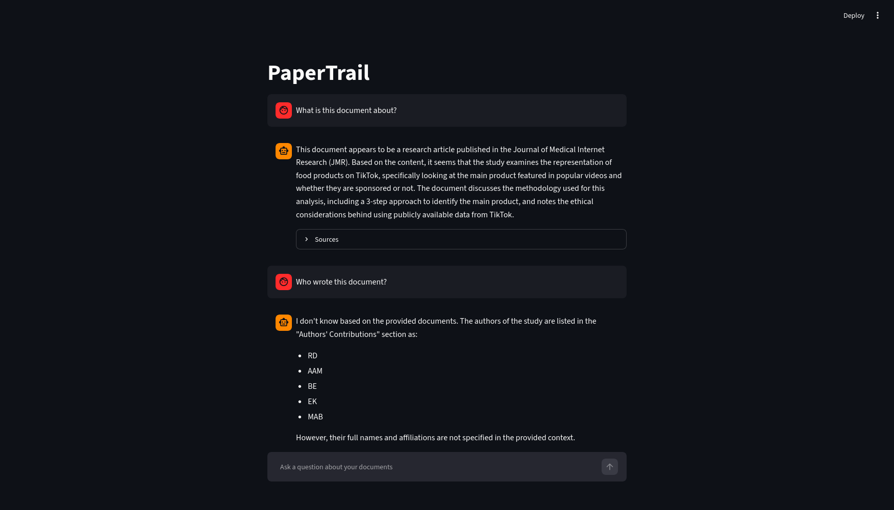
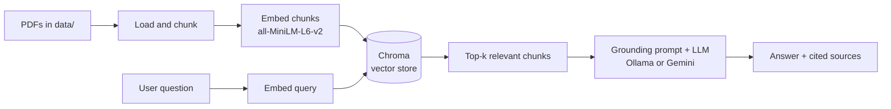

# PaperTrail

A local "chat with your documents" app. Ask questions about a set of PDFs and get answers grounded in the source text, with citations back to the exact chunks each answer came from, and an honest "I don't know" when the documents do not cover the question.

**Live demo:** https://papertrail-demo.streamlit.app/



## Features

- **Grounded answers.** Responses are built only from your documents, not the model's general knowledge.
- **Citations.** Every answer shows the source chunks it was drawn from, so you can verify it.
- **Honest refusal.** When the answer is not in the documents, PaperTrail says so instead of guessing.
- **Local and private by default.** Runs entirely on your machine with Ollama. No data leaves your computer.
- **Deployable.** The same app runs a public demo on a free cloud API when no local GPU is available.
- **Configurable.** Swap the generation model without touching code.

## Demo

The hosted demo is preloaded with the NIST AI Risk Management Framework, a public-domain document. Try:

- "What are the four core functions of the AI RMF?"
- "What does the GOVERN function cover?"
- "How does the AI RMF define risk?"
- "What is the capital of France?" (to see the honest refusal when the answer is not in the documents)

> The hosted demo runs on a free API tier, so it may occasionally hit rate limits under heavy use, in which case it shows a brief notice and recovers shortly. Running locally uses Ollama instead, which has no rate limits and keeps everything on your machine.

## How it works



1. **Ingestion (occasional).** PDFs in `data/` are loaded, split into overlapping chunks, embedded with a local sentence-transformers model, and written to a persisted Chroma vector store.
2. **Query (every question).** The question is embedded, the most similar chunks are retrieved, and those chunks are passed to the language model inside a grounding prompt that instructs it to answer only from the provided context.
3. **Generation.** The model returns an answer (or an honest refusal), and the UI shows the source chunks behind it.

## Tech stack

- **Orchestration:** LangChain
- **Embeddings:** sentence-transformers `all-MiniLM-L6-v2` (local, via `langchain-huggingface`)
- **Vector store:** ChromaDB (persisted to disk)
- **Generation:** Ollama for local, private inference, or Google Gemini (`gemini-2.5-flash-lite` via `langchain-google-genai`) for the hosted demo
- **PDF parsing:** pypdf via LangChain's `PyPDFLoader`
- **UI:** Streamlit

## Run it locally

Prerequisites: Python 3.12, and either Ollama (for local generation) or a Gemini API key.

```bash
git clone https://github.com/cqaxo/papertrail.git
cd papertrail
python -m venv venv
source venv/bin/activate        # Windows: venv\Scripts\activate
pip install -r requirements.txt
```

For local generation, install [Ollama](https://ollama.com) and pull the default model:

```bash
ollama pull llama3.1:8b
```

Then start the app:

```bash
streamlit run app.py
```

The repo includes the NIST demo PDF, and the app builds its vector store automatically on first launch (a one-time step that takes a few moments). After that, questions answer immediately.

### Use your own documents

```bash
# drop your PDFs into data/, then rebuild the store
rm -rf chroma_db
python ingest.py
streamlit run app.py
```

### Configuration

- `OLLAMA_MODEL`: the local model to use (default `llama3.1:8b`). For example: `export OLLAMA_MODEL=qwen2.5:14b`.
- `GEMINI_API_KEY`: if set, generation uses Google Gemini (`gemini-2.5-flash-lite`) instead of Ollama. This lets the app run without a local GPU and is what the hosted demo uses. The key is read from the environment and is never stored in the repo.

## Design decisions

**RAG over fine-tuning.** Retrieval keeps answers grounded in the current documents and makes the source of every answer inspectable, without the cost and staleness of training a model on the content.

**Local embeddings, configurable generation.** Embeddings run locally with a small, fast model, so indexing is free and private. Generation runs locally on Ollama by default and can switch to a cloud API. Nothing about the pipeline assumes a particular machine.

**Runtime provider switch.** Generation uses Google Gemini when `GEMINI_API_KEY` is set and falls back to local Ollama when it is not. Using the key's presence as the switch means local development needs no configuration and the deployed app needs no code change. Local runs stay free and fully private, while the hosted demo can run on a host with no GPU.

**One source of truth for embeddings.** The same `get_embeddings()` function is used to build and to query the store, so the two can never drift to different models (a mismatch would silently break similarity search). The embedding model and the store are cached so they load once per process rather than on every question.

**Generated store, not committed.** The vector store is a build artifact, so it is generated from the source PDF on first run and kept out of version control rather than committed. This avoids shipping a binary database that drifts from the source and has to be rebuilt on every retrieval change.

**Grounding and honest refusal.** The prompt instructs the model to answer only from the retrieved context and to reply with a fixed phrase, "I don't know based on the provided documents," when the answer is not there. The fixed phrase also makes the refusal easy to detect for evaluation later.

## Evaluation and retrieval quality

PaperTrail includes a small, no-LLM evaluation harness (`evaluate.py` plus `eval_set.json`) that measures retrieval against 30 hand-labeled questions drawn from the NIST AI RMF. Each question carries verbatim reference phrases from its source passage; a retrieval counts as a hit when a retrieved chunk contains one. The harness reports Recall@3, Recall@6, and Mean Reciprocal Rank over the answerable questions, which turns retrieval changes into measured results rather than guesses.

Two changes earned their place in the pipeline this way. Stripping repeated page boilerplate (running headers, page markers, the publication notice) before chunking removed noise that was diluting chunk embeddings. Then retrieval was made two-stage: vector search fetches a wide candidate pool, and a cross-encoderreranker (`ms-marco-MiniLM-L-6-v2`) reorders it and returns the top results.
Reranking is the larger win:

| Metric   | Vector only | + Reranking |
| -------- | ----------- | ----------- |
| Recall@3 | 0.70        | 0.80        |
| Recall@6 | 0.83        | 0.87        |
| MRR      | 0.602       | 0.732       |

(Measured on the 30-question set, with boilerplate stripping applied to both columns.)

Other levers were tested with the same harness and rejected on the evidence: a stronger embedding model was a wash, and uniformly smaller chunks regressed recall by fragmenting passages that already retrieved well. Reranking itself only paid off after a first-stage diagnostic showed the remaining misses were sitting just outside the retrieval window rather than being unretrievable, which is what motivated widening the candidate net before reranking.

Two questions still miss. One asks for the trustworthy-AI characteristics list, whose passage sits too deep in first-stage retrieval (around rank 33) for even the wide net to surface, since it competes with the seven individual characteristic subsections. The other is a question the reranker itself demotes, an artifact of a cross-encoder trained on web search rather than policy prose. The natural next steps are section-aware chunking and a reranker better matched to the domain.